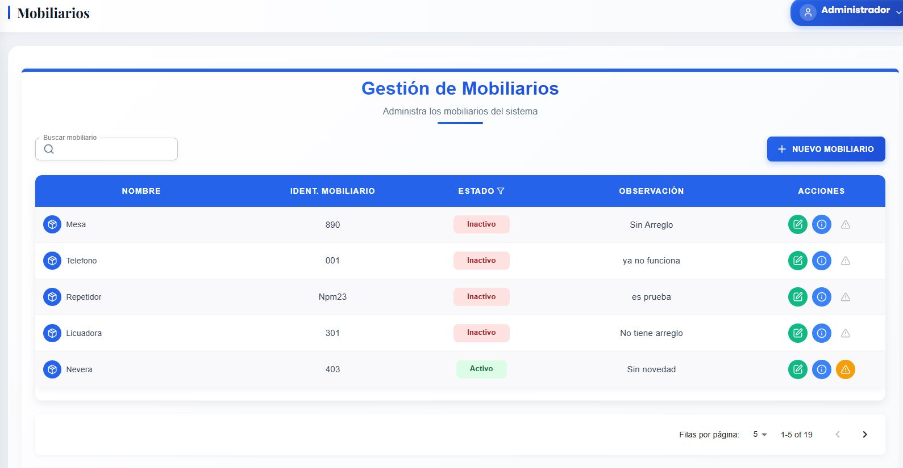
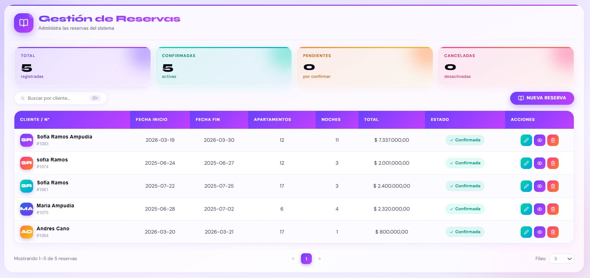

<div align="center">


# 🏨 ReservSoft

### Sistema de Gestión Hotelera Full Stack

*Plataforma integral para la administración de reservas, apartamentos, clientes y pagos hoteleros*

<br/>

[](https://reactjs.org/)
[](https://nodejs.org/)
[](https://mongodb.com/)
[](https://jwt.io/)
[](https://tailwindcss.com/)
[](https://www.chartjs.org/)
[](https://render.com/)

<br/>

**[🚀 Ver Demo en Vivo]https://reservsoftproject-2.onrender.com/**

<br/>

</div>

---

## 📋 Tabla de Contenidos

- [Descripción](#-descripción)
- [Características](#-características)
- [Tecnologías](#-tecnologías)
- [Arquitectura](#-arquitectura)
- [Instalación](#-instalación)
- [Variables de Entorno](#-variables-de-entorno)
- [Screenshots](#-screenshots)
- [Autor](#-autor)

---

## 📖 Descripción

**ReservSoft** es una aplicación web empresarial diseñada para centralizar y optimizar la gestión de un complejo hotelero. Permite administrar el ciclo completo de una reserva: desde la disponibilidad de apartamentos, la creación de reservas por clientes, hasta el seguimiento de pagos y la gestión del personal con control de acceso por roles.

Construida con una arquitectura **cliente-servidor desacoplada** (SPA + REST API), garantiza escalabilidad, seguridad mediante **JWT** y una experiencia de usuario fluida con dashboard de métricas visualizadas con **Chart.js**.

---

## ✨ Características

| Módulo | Descripción |
|---|---|
| 🔐 **Autenticación** | Login seguro con JWT, rutas protegidas y expiración de sesión |
| 👥 **Usuarios** | CRUD completo con validaciones estrictas y control de estado |
| 🛡️ **Roles & Permisos** | Gestión de roles con asignación dinámica de permisos por módulo |
| 🏠 **Tipo Apartamento** | Categorización de unidades por tipo con configuración de tarifas |
| 🏨 **Apartamentos** | Inventario de unidades con tipo, estado y disponibilidad |
| 🛋️ **Hospedaje** | Gestión de hospedajes activos vinculados a reservas |
| 🪑 **Mobiliario** | Inventario de mobiliario por unidad con edición y detalles |
| 👤 **Clientes** | Registro y administración de clientes con historial |
| 📅 **Reservas** | Creación, edición y seguimiento de reservas con fechas y titulares |
| 💳 **Pagos** | Registro de pagos parciales, estado y faltante por reserva |
| 🏷️ **Descuentos** | Configuración de descuentos por tipo de apartamento y vigencia |
| 📊 **Dashboard** | Panel con métricas y gráficas interactivas con Chart.js |
| 🌐 **Landing Page** | Página pública de presentación con sistema de reservas en línea |

---

## 🛠️ Tecnologías

### Frontend
- **React** (última versión) — Interfaz de usuario dinámica tipo SPA
- **Tailwind CSS** — Estilos utilitarios y diseño responsivo
- **Material UI** — Componentes de interfaz complementarios
- **Chart.js** — Gráficas y visualización de métricas en el dashboard
- **React Router** — Navegación y rutas protegidas por rol
- **Axios** — Cliente HTTP para consumo de la API REST
- **SweetAlert2** — Alertas y confirmaciones con diseño personalizado
- **Lucide React** — Iconografía moderna y consistente

### Backend
- **Node.js 20 + Express** — Servidor REST API de alto rendimiento
- **Mongoose** — ODM para modelado de datos en MongoDB
- **JSON Web Tokens (JWT)** — Autenticación stateless y segura
- **Bcrypt** — Hash y verificación de contraseñas
- **CORS** — Configuración de acceso entre orígenes
- **Middleware de permisos** — Control de acceso granular por rol y módulo

### Base de datos & Deploy
- **MongoDB Atlas** — Base de datos NoSQL en la nube
- **Render** — Hosting continuo del backend y frontend

---

## 🏗️ Arquitectura

```
reservsoftproject/
│
├── backend/                        # Node.js 20 + Express REST API
│   ├── src/
│   │   ├── features/               # Módulos organizados por dominio
│   │   │   ├── apartamento/
│   │   │   ├── auth/
│   │   │   ├── clientes/
│   │   │   ├── dashboard/
│   │   │   ├── descuentos/
│   │   │   ├── hospedaje/
│   │   │   ├── landing/
│   │   │   ├── mobiliarios/
│   │   │   ├── pagos/
│   │   │   ├── reservas/
│   │   │   ├── roles/
│   │   │   ├── tipoApartamento/
│   │   │   └── usuarios/
│   │   ├── middlewares/
│   │   │   └── permisos.js         # Control de acceso por rol
│   │   └── tests/
│   ├── config/
│   └── .env
│
└── frontend/                       # React SPA
    ├── public/
    └── src/
        ├── features/               # Módulos espejo del backend
        │   ├── apartamentos/
        │   ├── auth/
        │   ├── clientes/
        │   ├── dashboard/
        │   ├── descuentos/
        │   ├── hospedaje/
        │   ├── landing/
        │   ├── mobiliarios/
        │   ├── pagos/
        │   ├── reservas/
        │   ├── roles/
        │   ├── tipoApartamentos/
        │   └── usuarios/
        ├── services/               # Llamadas centralizadas a la API
        ├── utils/                  # Helpers y utilidades compartidas
        └── lib/
```

---

## ⚙️ Instalación

### Prerrequisitos

- Node.js ≥ 20
- npm ≥ 10
- Cuenta en MongoDB Atlas (o instancia local de MongoDB)

### 1. Clonar el repositorio

```bash
git clone https://github.com/Dcano96/reservsoftproject.git
cd reservsoftproject
```

### 2. Instalar dependencias del backend

```bash
cd backend
npm install
```

### 3. Instalar dependencias del frontend

```bash
cd ../frontend
npm install
```

### 4. Configurar variables de entorno

Crear un archivo `.env` en `/backend` con las variables de la sección siguiente.

### 5. Ejecutar en desarrollo

```bash
# Terminal 1 — Backend (http://localhost:5000)
cd backend
npm run dev

# Terminal 2 — Frontend (http://localhost:3000)
cd frontend
npm start
```

---

## 🔑 Variables de Entorno

Crear `/backend/.env`:

```env
# Servidor
PORT=5000
NODE_ENV=development

# Base de datos
MONGO_URI=mongodb+srv://<usuario>:<password>@cluster.mongodb.net/reservsoft

# Autenticación
JWT_SECRET=tu_clave_secreta_aqui
JWT_EXPIRES_IN=7d

# CORS
FRONTEND_URL=http://localhost:3000
```

---

## 📸 Screenshots

### 🔐 Login

| Pantalla principal | Vista alternativa |
|---|---|
|  |  |

---

### 📊 Dashboard


---

### 🌐 Landing Page

| Vista 1 | Vista 2 | Vista 3 |
|---|---|---|
|  |  |  |

---

### 👥 Gestión de Usuarios

| Lista | Crear | Editar | Detalles |
|---|---|---|---|
|  |  |  |  |

---

### 🛡️ Gestión de Roles

| Lista | Crear | Editar | Detalles |
|---|---|---|---|
|  |  |  |  |

---

### 🏠 Tipo de Apartamento

| Lista | Editar | Detalles |
|---|---|---|
|  |  |  |

---

### 🏨 Apartamentos

| Lista | Crear | Editar | Detalles |
|---|---|---|---|
|  |  |  |  |

---

### 🛋️ Hospedaje

| Crear | Editar |
|---|---|
|  |  |

---

### 🪑 Mobiliario

| Lista | Detalles | Editar |
|---|---|---|
|  |  |  |

---

### 📅 Reservas

| Lista | Crear | Detalles |
|---|---|---|
|  |  |  |

---

## 👨‍💻 Autor

<div align="center">

**David Andres Goez Cano**

*Desarrollador Full Stack*

[](https://github.com/Dcano96)
[](https://www.linkedin.com/in/david-goez-a0171a20a)

</div>

---

<div align="center">

*Desarrollado con ❤️ — ReservSoft © 2024*

</div>